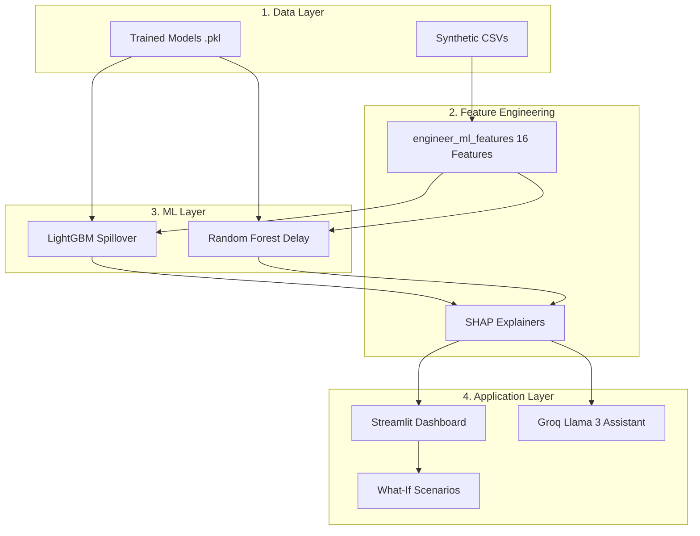

# Fiserv Delivery Intelligence Suite (FDIS)

[](LICENSE)
[](https://www.python.org/downloads/)
[](https://streamlit.io/)
[](https://www.auckland.ac.nz/)
[](https://www.fiserv.com/)

> **Report**: *Fiserv Delivery Intelligence Suite: An AI-Driven Impact Estimator for Agile Project Delivery (2026)*
> **Author**: [Gurudas Salunke](mailto:gsal919@aucklanduni.ac.nz)
> **Affiliation**: Department of Computer Science, University of Auckland, New Zealand
> **Industry Mentors**: Justin Soon and Ajai Pillai, Fiserv
> **Academic Supervisor**: Dr. Thomas Lacombe, University of Auckland

Official implementation of the **Fiserv Delivery Intelligence Suite (FDIS)**, an AI-powered decision support system for estimating the delivery impact of mid-sprint scope changes in Agile software development. FDIS combines classification, regression, and explainable AI to reduce manual estimation time from **hours/days to under one second**.

---

## 🎯 Project Context

During my industry internship with Fiserv, project managers had no fast way to estimate the delivery impact of client-requested scope changes without manually consulting delivery, development, QA, and BA teams — a process that took hours or days and delayed client decisions. FDIS addresses this by providing instant, data-driven estimates of **spillover risk** and **expected delay days** through an interactive dashboard and grounded AI assistant.

---

## 🚀 Key Results

At a **50,000 change request** training scale with an **80/10/10 time-based split**, FDIS delivers:

📈 **86.6% Spillover Classification Accuracy** (F1 = 0.797)
🎯 **1.36-day Delay Prediction MAE** (R² = 0.916, explaining 91.6% of variance)
⚡ **<1 second Dashboard Response Time** (vs. hours/days for manual estimation)
🔍 **SHAP-Grounded AI Assistant** with zero hallucination through grounded context

| Model | Task | Metric | Value |
| :--- | :--- | :--- | :--- |
| **LightGBM** | Spillover Classification | F1 / Accuracy | **0.797 / 86.6%** |
| **Random Forest** | Delay Regression | MAE / R² | **1.36 days / 0.916** |
| **LightGBM** | Severity Classification (5-class) | Accuracy | **87.8%** |

---

## 🧠 Methodology & Architecture

FDIS integrates three layers: **Data**, **Machine Learning**, and **Application**.



### Formal Feature Specification

> [!NOTE]
> **Feature Vector** $\mathbf{x} \in \mathbb{R}^{16}$ used for both models:
>
> **Core Agile Metrics**
> - $x_1 =$ `story_points`, $x_2 =$ `days_into_sprint`, $x_3 =$ `sprint_duration`
> - $x_4 =$ `priority_encoded` $\in \{0,1,2,3\}$, $x_5 =$ `affected_components`
>
> **Capacity Features**
> - $x_6 =$ `team_headcount`
> - $x_7 =$ `base_remaining_capacity_hours` $= C \cdot (1 - p) \cdot (1 - u)$
> - $x_8 =$ `available_capacity_ratio` $= x_7 / C$
>
> **Utilisation Feature**
> - $x_9 =$ `utilisation_factor` $\in [0,1]$
>
> **Engineered Features**
> - $x_{10} =$ `sprint_progress` $= x_2 / x_3$
> - $x_{11} =$ `remaining_sprint_pct` $= 1 - x_{10}$
> - $x_{12} =$ `complexity_score` $= x_1 \cdot x_5 \cdot 0.5$
> - $x_{13} =$ `story_points_log` $= \ln(1 + x_1)$
> - $x_{14}, x_{15}, x_{16} =$ `has_estimate`, `has_story_points`, `item_type_encoded`
>
> **Spillover Post-Processing Rule**
> $$\text{if } \hat{y}_{\text{delay}} > (x_3 - x_2) \implies P(\text{spillover}) := 1.0$$

---

## 🛠️ Installation

```bash
# Clone the repository
git clone https://github.com/gsal919/Mid-Sprint-Change-Impact-Estimator.git
cd Mid-Sprint-Change-Impact-Estimator

# Option A: Conda (Recommended)
conda env create -f environment.yml
conda activate fiserv

# Option B: Pip
python -m venv .venv
source .venv/bin/activate  # Windows: .venv\Scripts\activate
pip install -r requirements.txt
```

---

## ⚡ Quickstart

### 1. Generate Synthetic Data

```bash
cd src
python fiserv_data_generator.py --num_changes 50000 --target_tasks 5000
```

### 2. Feature Engineering

```bash
python feature_engineering.py --input ../data/raw/change_requests.csv
```

### 3. Train Models

```bash
# Spillover classifier (LightGBM)
python train_models.py --model lightgbm --task spillover

# Delay regressor (Random Forest)
python train_models.py --model randomforest --task delay
```

### 4. Feature Ablation Study

```bash
python ablation_study.py --target delay_days_caused
```

### 5. Launch Dashboard

```bash
cd ..
streamlit run dashboard.py
```

Dashboard opens at `http://localhost:8501`.

---

## 📊 Comprehensive Results

### Table I: Model Comparison (Time-Based 80/10/10 Split)

| Model | Task | F1 (↑) | Accuracy (↑) | MAE (↓) | R² (↑) |
| :--- | :--- | :---: | :---: | :---: | :---: |
| **LightGBM** | Spillover Classification | **0.797** | **86.6%** | — | — |
| XGBoost | Spillover Classification | 0.794 | 87.6% | — | — |
| Random Forest | Spillover Classification | 0.788 | 86.0% | — | — |
| **Random Forest** | Delay Regression | — | — | **1.36** | 0.916 |
| XGBoost | Delay Regression | — | — | 1.47 | **0.919** |
| LightGBM | Delay Regression | — | — | 1.58 | 0.916 |

> **Key Finding**: All three ensemble methods perform comparably (F1 > 0.79, R² > 0.91), confirming that **feature engineering has a substantially larger impact than model selection**.

### Table II: Feature Ablation Study (Delay Regression)

| Feature Set | # Features | R² (↑) | MAE (↓) | Insight |
| :--- | :---: | :---: | :---: | :--- |
| Core (story_points, days_into_sprint, priority) | 5 | 0.745 | 2.73 | Baseline |
| + Capacity (headcount, remaining_capacity) | 8 | 0.868 | 1.61 | **+16.5% R² gain** |
| + Utilisation (utilisation_factor) | 9 | **0.917** | **1.36** | **Largest marginal gain** |
| + Engineered (complexity_score, etc.) | 16 | 0.918 | 1.35 | Marginal |
| All Features | 16 | 0.918 | 1.35 | Same as engineered |

> **Key Takeaway**: The `utilisation_factor` was the single most impactful feature, contributing a **5.6% marginal R² improvement**. Overall, domain-aware feature engineering improved R² by **+23%** (0.745 → 0.918), far exceeding any gains from hyperparameter tuning.

### Table III: Error Analysis (Sprint 22, Team: Amazon, 1 Component)

| Case | SP | Days | Priority | Predicted Delay | Actual Delay | Error | Key Insight |
| :---: | :---: | :---: | :---: | :---: | :---: | :---: | :--- |
| 1 | 3 | 2 | Medium | 0.0 d | 0 d | 0 | Correctly predicts on-time |
| 2 | 8 | 7 | High | 1.2 d | 4 d | +0.2 | Underestimated carry-over |
| 3 | 5 | 9 | Critical | 0.1 d | 2 d | −0.9 | Missed next-sprint cost |
| 4 | 13 | 1 | Low | 0.1 d | 10 d | −0.9 | Well-calibrated (total 19.1 vs 20 d) |
| 5 | 13 | 6 | Critical | 13.2 d | 15 d | +2.8 | Underestimated combined effect |
| 6 | 10 | 5 | Medium | 4.6 d | 8 d | +1.6 | Moderate underestimate |

> **Key Insight**: The model performs well for low- and medium-complexity changes. Larger errors occur for high-priority, large-story-point changes where capacity and coordination overhead are harder to capture — suggesting interaction features (e.g., `story_points × priority_encoded`) as future work.

---

## 🖥️ Dashboard Features

| Feature | Description |
| :--- | :--- |
| **Impact Estimator** | Real-time spillover risk + expected delay with risk gauge |
| **Planning View** | 21-week Gantt timeline with sprint boundaries + delay propagation |
| **Data Overview** | Team skill coverage and delay heatmaps |
| **Result Explanations** | SHAP global importance + local waterfall plots |
| **What-If Simulation** | One-click trade-offs (split points, add developer, defer sprint) |
| **AI Assistant** | Groq Llama 3 grounded in SHAP contributions |
| **Edge-Case Handling** | Automatic next-sprint recalculation |
| **Reprioritisation Logic** | Quantifies delay to current work if preempted |

---

## 📁 Repository Structure

```text
Mid-Sprint-Change-Impact-Estimator/
├── data/                        # Synthetic CSV output             
├── models/                      # Model architectures and utilities
├── dashboard.py                 # Streamlit application
├── requirements.txt
├── environment.yml
└── README.md
```

---

## 🌐 Deployment

| Resource | Link |
| :--- | :--- |
| **Live Dashboard** | [gurudas-mid-sprint-change-impact-estimator.streamlit.app](https://gurudas-mid-sprint-change-impact-estimator.streamlit.app) |
| **GitHub Repository** | [github.com/gsal919/Mid-Sprint-Change-Impact-Estimator](https://github.com/gsal919/Mid-Sprint-Change-Impact-Estimator) |

---

## 📜 Citation & License

If you find this work useful, please consider citing it:

```bibtex
@misc{salunke2026fiserv,
  title={Fiserv Delivery Intelligence Suite: An AI-Driven Impact Estimator for Agile Project Delivery},
  author={Salunke, Gurudas},
  year={2026},
  institution={University of Auckland},
  note={Industry Project with Fiserv}
}
```

### License Notice

- **Code Repository**: The source code within this repository is open-sourced under the [MIT License](LICENSE) for academic, research, and educational purposes.
- **Algorithmic Methods & Feature Engineering**: The underlying feature engineering pipeline, capacity-aware modelling, and dashboard design are shared for academic and research purposes. Commercial use requires explicit permission from the author.

---

## 🙏 Acknowledgements

- **Industry Mentors**: Justin Soon and Ajai Pillai (Fiserv)
- **Academic Supervisor**: Dr. Thomas Lacombe (University of Auckland)
- **Employer Liaison**: Rebecca Du (University of Auckland)

**Built with:** Python · LightGBM · Random Forest · SHAP · Streamlit · Plotly · Groq API
